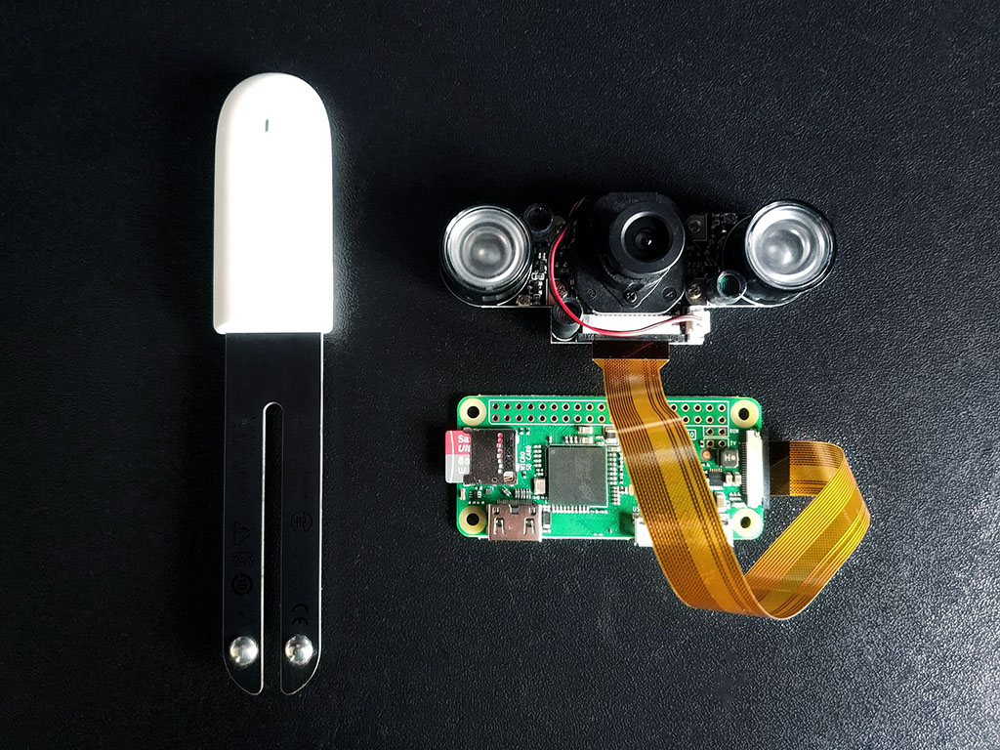

MiFlora Raspberry Gateway
-------------------------

A simple raspberry gateway for MiFlora sensors made with nodejs.

Requirements:

- MiFlora sensor
- Raspberry Pi Zeo W
- Raspberry Pi camera module
- Miflora Mqtt Daemon
- NodeJs
